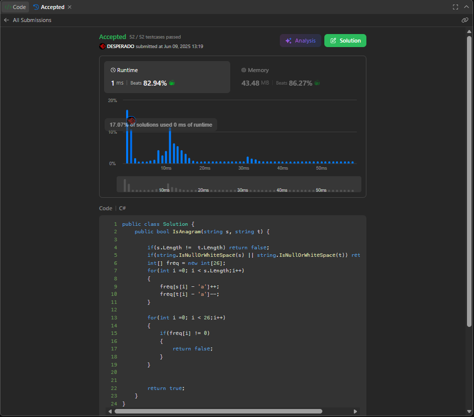
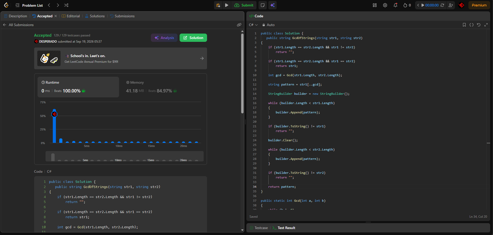

## الحساب

[حساب LeetCode](https://leetcode.com/u/uODsjF4zTG/)

## Valid Anagram

رابط المسألة: [Valid Anagram](https://leetcode.com/problems/valid-anagram/)

لغة الحل: **C#**.

## Greatest Common Divisor of Strings

رابط المسألة: [Greatest Common Divisor of Strings](https://leetcode.com/problems/greatest-common-divisor-of-strings/)

لغة الحل: **C#**.

